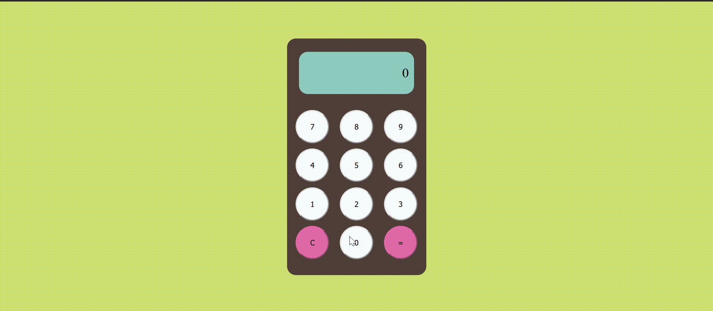
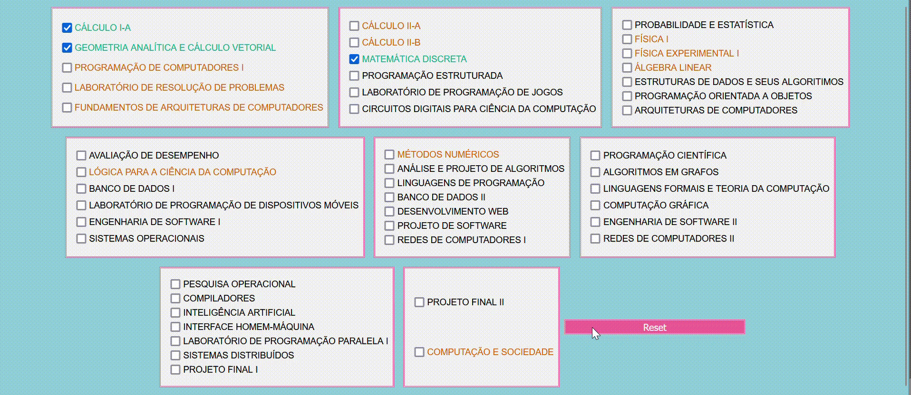
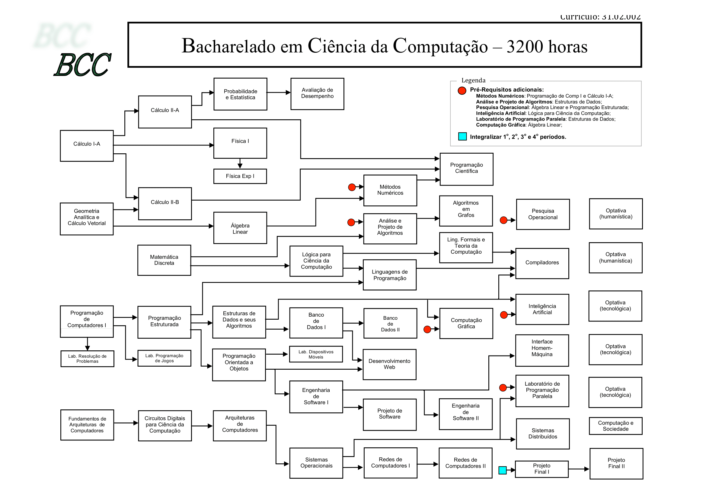

# Front-End

## :scroll: Introdução

> Repositório formado por pequenas aplicações realizadas durante o estudo de tecnologias para Front-End.

## :gear: Ferramentas

- **HTML** - Linguagem de marcação;
- **CSS** - Linguagem de estilo;
- **JavaScript** - Linguagem de script;
- **Firefox** - Navegador;

## :abacus: Beaver's Game

> Aplicação no formato de calculadora que recebe do usuário um número e retorna o animal correspondente com base na tabela. 

| Grupo | Números           | Animal    |
| ----- | ----------------- | --------- |
| 1     | 01 - 02 - 03 - 04 | Avestruz  |
| 2     | 05 - 06 - 07 - 08 | Aguia     |
| 3     | 09 - 10 - 11 - 12 | Burro     |
| 4     | 13 - 14 - 15 - 16 | Borboleta |
| 5     | 17 - 18 - 19 - 20 | Cachorro  |
| 6     | 21 - 22 - 23 - 24 | Cabra     |
| 7     | 25 - 26 - 27 - 28 | Carneiro  |
| 8     | 29 - 30 - 31 - 32 | Camelo    |
| 9     | 33 - 34 - 35 - 36 | Cobra     |
| 10    | 37 - 38 - 39 - 40 | Coelho    |
| 11    | 41 - 42 - 43 - 44 | Cavalo    |
| 12    | 45 - 46 - 47 - 48 | Elefante  |
| 13    | 49 - 50 - 51 - 52 | Galo      |
| 14    | 53 - 54 - 55 - 56 | Gato      |
| 15    | 57 - 58 - 59 - 60 | Jacaré    |
| 16    | 61 - 62 - 63 - 64 | Leão      |
| 17    | 65 - 66 - 67 - 68 | Macaco    |
| 18    | 69 - 70 - 71 - 72 | Porco     |
| 19    | 73 - 74 - 75 - 76 | Pavão     |
| 20    | 77 - 78 - 79 - 80 | Peru      |
| 21    | 81 - 82 - 83 - 84 | Touro     |
| 22    | 85 - 86 - 87 - 88 | Tigre     |
| 23    | 89 - 90 - 91 - 92 | Urso      |
| 24    | 93 - 94 - 95 - 96 | Veado     |
| 25    | 97 - 98 - 99 - 00 | Vaca      |

## :memo: Course Check

> Aplicação que permite que você marque as disciplinas concluídas e obtenha as que já cumprem os pré-requisitos para serem cursadas.

## :clapper: LetterBot

> Ferramenta para comparar registros do Letterboxd de dois usuários.

